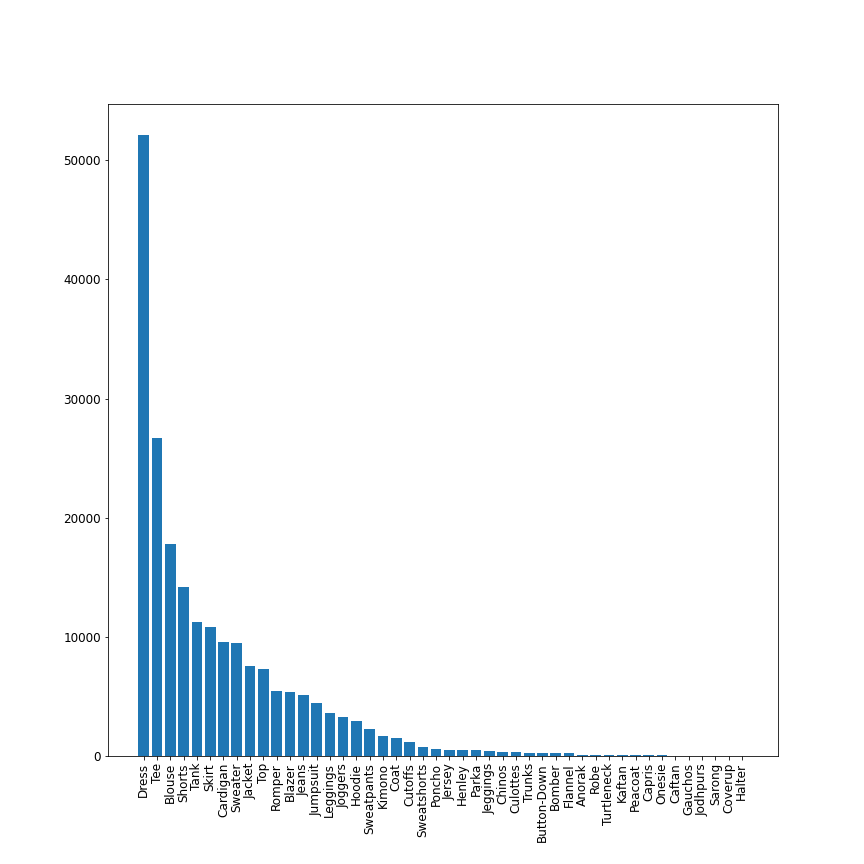
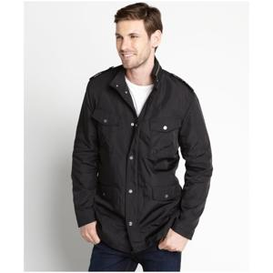
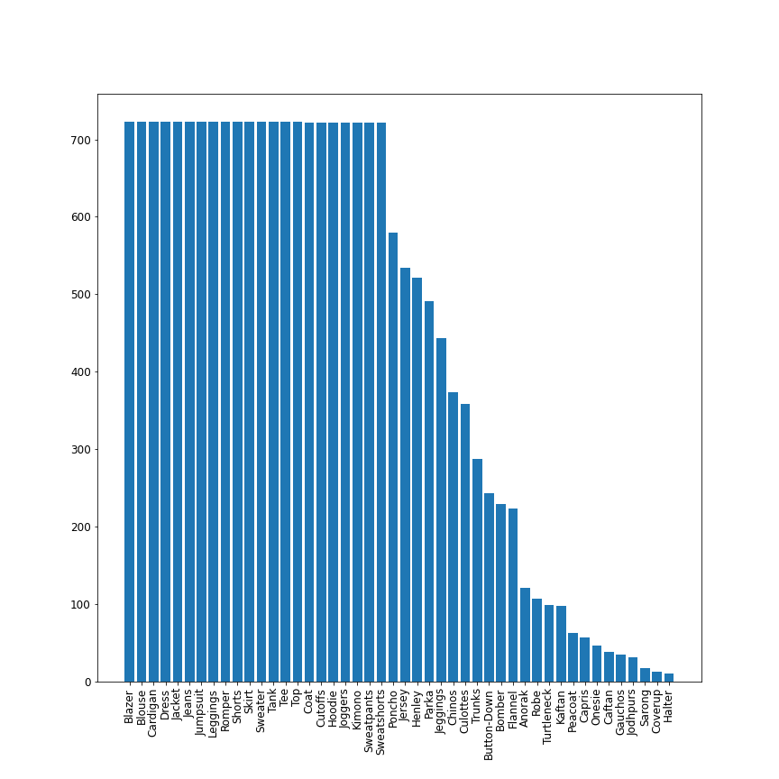
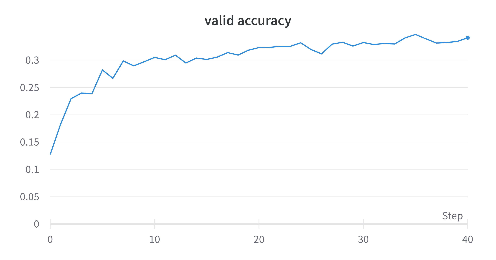
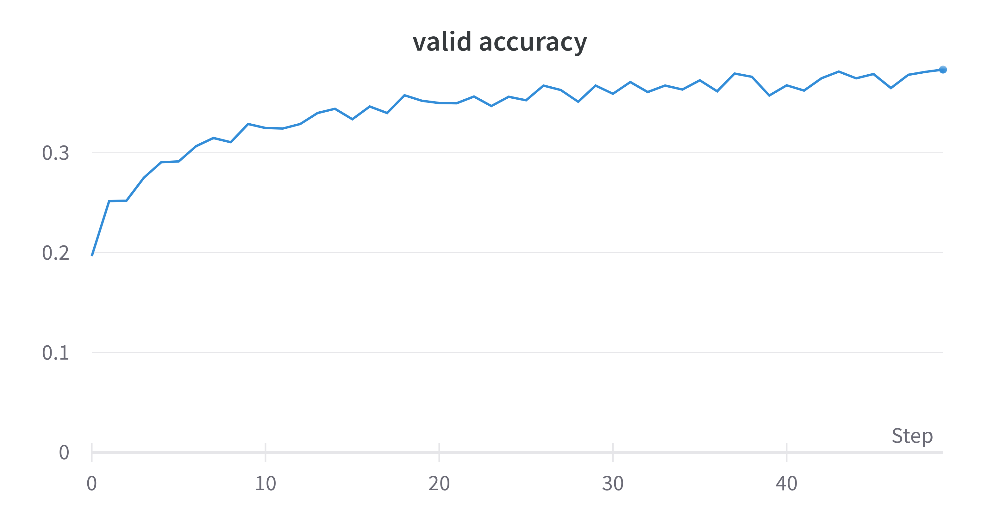
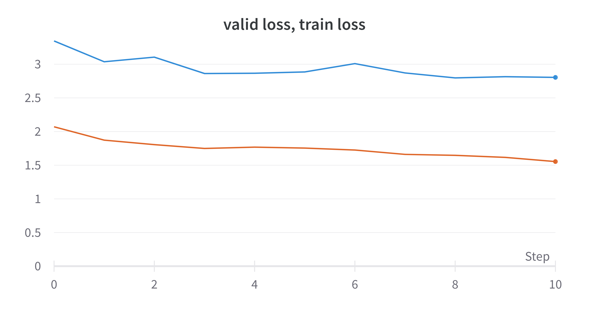
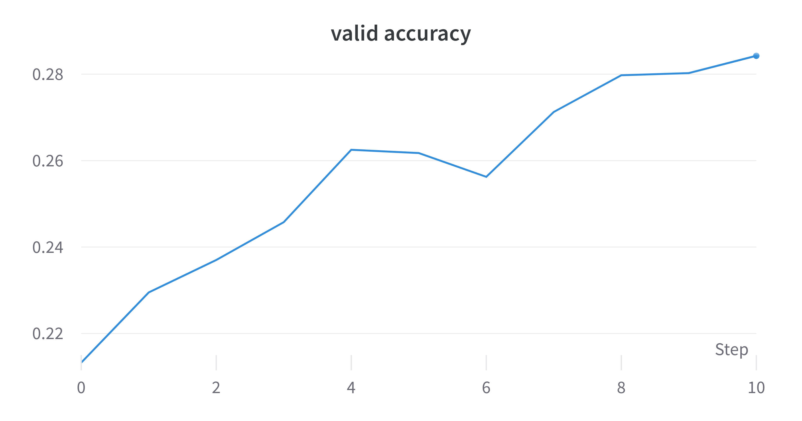
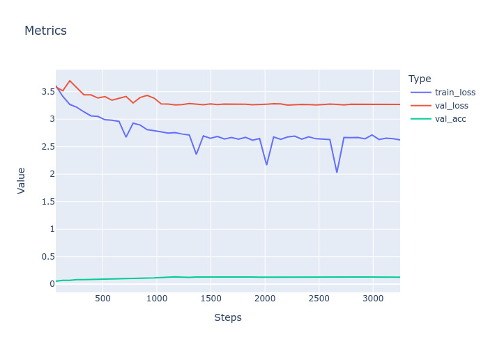
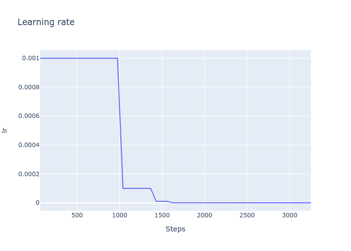

# Problem Statment

Assume that we would like to create **a clothing type classifier**. 

You are required to select one of the **freely available datasets** and **create an initial model** to deliver a prototype of the solution. 

## Data
 
DeepFashion is the largest data on the web related to clothes. The dataset I have is 209222 for training,  40000 for validation, and 40000 for testing.

It has 46 classes and is highly imbalanced.

The largest class has 52138, and the smallest class has 11 images. In addition to this, the images have many variations from different sources. 
 

 Also, the images have more than one class but are labeled with only one class. There are many classes similar to each other for humans. There are a lot of deviations in the same class, and there is some noise. 
 The dataset has difficulty for the normal human to recognize all of the actual classes. 

This image has an actual label blazer, but I don't see it like this. Also, it has other items.

The dataset has these classes.

<table>
  <tr>
    <td>Anorak</td>
    <td>Blazer</td>
    <td>Blouse</td>
    <td>Bomber</td>
    <td>Trunks</td>
  </tr>
    <tr>
    <td>Button-Down</td>
    <td>Caftan</td>
    <td>Capris</td>
    <td>Cardigan</td>
    <td>Chinos</td>
  </tr>
    <tr>
    <td>Coat</td>
    <td>Coverup</td>
    <td>Culottes</td>
    <td>Cutoffs</td>
    <td>Dress</td>
  </tr>
  <tr>
    <td>Flannel</td>
    <td>Gauchos</td>
    <td>Halter</td>
    <td>Henley</td>
    <td>Hoodie</td>
  </tr>
    <tr>
    <td>Jacket</td>
    <td>Jeans</td>
    <td>Jeggings</td>
    <td>Jersey</td>
    <td>Jodhpurs</td>
  </tr>
    <tr>
    <td>Joggers</td>
    <td>Jumpsuit</td>
    <td>Kaftan</td>
    <td>Kimono</td>
    <td>Leggings</td>
  </tr>
    <tr>
    <td>Onesie</td>
    <td>Parka</td>
    <td>Peacoat</td>
    <td>Poncho</td>
    <td>Robe</td>
  </tr>
    <tr>
    <td>Romper</td>
    <td>Sarong</td>
    <td>Shorts</td>
    <td>Skirt</td>
    <td>Sweater</td>
  </tr>
    <tr>
    <td>Sweatpants</td>
    <td>Sweatshorts</td>
    <td>Tank</td>
    <td>Tee</td>
    <td>Top</td>
    <td>Turtleneck</td>
  </tr>
</table>

So the data comes with challenges. In only 
For four days I built a package called yamani, and I am still working on the model to optimize the results.

## Preprocessing & Augmentation        
 
- Normalaized RGB images
- train dataset: 20922 images (10% train data)
- val dataset: 4000 images (10% train data)
- test dataset: 4000 images (10% train data)
- The classes almost balanced better than original 
- The class **Dress** has the greatest size with **723**  
- The class **Halter** has the lowest size with **11**  
- Images 3 channels RGB float range(-2.1179, 2.6400) 
- Labels int range(0, 45) 
- Simple Augmentation like rotation, random resize crop, .. 
- Labels int range(0, 45) 

And to make this happens I build my custom ClothesDataset.

### The destribution after taking  10% of the images with keeping the lowest classes.

Better in distribution than before.

## Metrics
 

I used two metrics

1. NLLLoss measures the loss. I see it is better than cross-entropy because the output of the model 
$-log{_2}({x})$. So the output of the model will vary from 0 to inf and gives me large values better than small float numbers. 

2. Accuracy is not the best metric here because the images are imbalanced, but F-score.  I used it anyway.

3. It is good to measure topK accuracy results because the image has more than one item.

## Experiments
     

    📌 &nbsp;<b><u>EXperiment1: Transfer learning using vgg16:</u></b> 

- hidden layers = [64]

- lr = 0.001

- dropout = 0.2

- The descriptor has size <b>25088 1-dim vector</b> from any size from the image

- Epoch 4 .. train_loss: 2.270.. valid_loss: 2.313 .. valid_accuracy: 33.225%

    📌 &nbsp;<b><u>EXperiment2: Transfer learning using vgg16:</u></b> 

- hidden layers = [1024, 128]

- lr = 0.001 

- dropout = 0.2

- The descriptor has size <b>25088 1-dim vector</b> from any size from the image

- Epoch 5 train_loss: 2.009.. valid_loss: 2.193 .. valid_accuracy: 38.325

    📌 &nbsp;<b><u>EXperiment3: Increase train data size: VGG16</u></b> 

- Epoch 1 .. train_loss: 1.616.. valid_loss: 2.815 .. valid_accuracy: 28.025%

- lr = 0.001  - whole data - Training size: 209222  -  headen sizes:   [1024, 128]

Note we should train on small data because epoch takes ~ 3 hours. Then after some good results we can fune the model with the whole original data.

    📌 &nbsp;<b><u>EXperiment4: Transfer learning using resnet34:</u></b> 

 
- The descriptor has size <b>512 1-dim vector</b> from any size from the image

- No hidden layers

- lr = 0.001

- Epoch: 4 .. train_loss: 2.195, valid_loss: 2.288, valid_accuracy: 35.475

- test_loss: 2.313, test_accuracy: 33.325%

    📌 &nbsp;<b><u>EXperiment5: Transfer learning using resnet34:</u></b> 

 
- The descriptor has size <b>512 1-dim vector</b> from any size from the image

- Apply schedular for lr, and starting lr with 0.1

- Epoch 2 .. train_loss: 6.277.. valid_loss: 6.521 .. valid_accuracy: 30.150%

-----------------------------------------------------------

- Apply schedular for lr, and starting lr with 0.01

- Epoch: 2 .. train_loss: 2.198, valid_loss: 2.409, valid_accuracy: 35.050

    📌 &nbsp;<b><u>EXperiment6: Custom CNN:</u></b> 

- Epoch: 4 .. train_loss: 2.630, valid_loss: 3.273, valid_accuracy: 13.100

- HEADEN_SIZES = [256, 128] - DROPOUT = 0.2 - 0.1 * dtata

